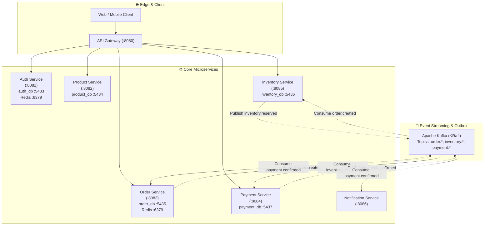

# 🧭 Architectural Planner & Roadmap — Event-Driven E-Commerce Platform

> **Status:** Active Execution  
> **Last Updated:** 2026-10-08  
> **Architecture Style:** Event-Driven Microservices · Choreographed Sagas · Transactional Outbox · Multi-Database Persistence · In-Memory Caching  
> **Tech Stack:** Java 21 · Spring Boot 4.1.1 · PostgreSQL · Apache Kafka · Redis · Docker · Flyway · JWT · OAuth2

---

## 🏗️ 1. System Vision & Architecture Topology

The platform is designed as an enterprise-grade, event-driven e-commerce backend built with asynchronous decoupling, data durability, and resilient distributed state management. Each business capability is modeled as an independent microservice with its own dedicated relational database, sharing no database instances across service boundaries.



---

## 📊 2. Service Matrix & Infrastructure Footprint

| Service | Port | Database | DB Port | Cache / Store | Primary Domain Responsibility |
|---|:---:|---|:---:|:---:|---|
| **API Gateway** | 8080 | — | — | Redis (Rate limiting) | Edge routing, JWT pass-through, CORS, resilience |
| **Auth Service** | 8081 | `auth_db` | 5433 | Redis (Rate limiting) | Identity, registration, tokens, refresh rotation, OAuth2 |
| **Product Service** | 8082 | `product_db` | 5434 | — | Product catalog, categories, pricing, customer & admin CRUD |
| **Inventory Service** | 8085 | `inventory_db` | 5436 | — | Stock tracking, reservations, releases, optimistic locking (`@Version`) |
| **Order Service** | 8083 | `order_db` | 5435 | Redis (Guest cart TTL) | Shopping cart, wishlist, checkout, order state machine |
| **Payment Service** | 8084 | `payment_db` | 5437 | — | Payment intent processing, mock/provider integration |
| **Notification Service** | 8086 | — | — | — | Email notifications, transactional templates |

### 📖 API Documentation (Swagger UI & OpenAPI Specs)

| Service | Swagger UI Dashboard | OpenAPI 3.1 JSON Spec |
|---|---|---|
| **Auth Service** | [`http://localhost:8081/swagger-ui.html`](http://localhost:8081/swagger-ui.html) | [`http://localhost:8081/v3/api-docs`](http://localhost:8081/v3/api-docs) |
| **Product Service** | [`http://localhost:8082/swagger-ui.html`](http://localhost:8082/swagger-ui.html) | [`http://localhost:8082/v3/api-docs`](http://localhost:8082/v3/api-docs) |
| **Order Service** | [`http://localhost:8083/swagger-ui.html`](http://localhost:8083/swagger-ui.html) | [`http://localhost:8083/v3/api-docs`](http://localhost:8083/v3/api-docs) |
| **Inventory Service** | [`http://localhost:8085/swagger-ui.html`](http://localhost:8085/swagger-ui.html) | [`http://localhost:8085/v3/api-docs`](http://localhost:8085/v3/api-docs) |

---

## 🧩 3. Domain Deep Dive & Feature Design

### 🛒 A. Shopping Cart & Wishlist (Dual Storage Strategy)
To balance high-throughput anonymous browsing with permanent customer data durability:
1. **Guest Users (Redis Ephemeral Cache)**:
   - Identified by `X-Guest-Cart-Id` header.
   - Stored in Redis under `cart:guest:{guestCartId}` with automated **7-day TTL**.
   - Window shoppers and web crawlers do not pollute relational tables.
2. **Authenticated Users (PostgreSQL Durable Storage)**:
   - Identified by authenticated JWT claims (`customerId`).
   - Stored in PostgreSQL tables `carts` and `cart_items`.
   - Never expires; customer carts persist indefinitely across sessions and devices.
3. **Cart Merge on Login**:
   - Client calls `POST /api/v1/cart/merge` with `guestCartId`.
   - Redis guest items are merged into the user's PostgreSQL cart (combining quantities).
   - Redis guest key is purged immediately.
4. **Wishlist**:
   - Customer-tied permanent relational collection in PostgreSQL (`wishlists`, `wishlist_items`).
   - Seamless atomic operations to move items between Cart and Wishlist (`move-to-wishlist`, `move-to-cart`).

### 📦 B. Product & Inventory Decoupling
- Stock counts are strictly removed from `product-service` and isolated in `inventory-service`.
- Inventory uses JPA optimistic locking (`@Version`) with conflict handling returning `409 Conflict`.
- Quantity constraints (`available_quantity >= 0`, `reserved_quantity >= 0`) enforced at both database and domain levels.

### 💳 C. Order Lifecycle & Checkout
- **Checkout Action**: Converts active Cart into an `Order` with immutable price and product snapshots in `order_items`.
- Empties the customer's cart upon order placement.
- Order starts in `PENDING` state and advances through the distributed saga.

---

## 🔄 4. Distributed Patterns Plan

### 📨 A. Kafka Topic Contracts
- `order.created`: Emitted by Order Service upon checkout.
- `inventory.reserved`: Emitted by Inventory Service after stock reservation succeeds.
- `inventory.reservation.failed`: Emitted by Inventory Service if stock is insufficient.
- `inventory.released`: Emitted by Inventory Service on saga compensation.
- `payment.confirmed`: Emitted by Payment Service upon payment success.
- `payment.failed`: Emitted by Payment Service on payment failure.
- `order.completed`: Emitted by Order Service when payment is confirmed.
- `order.cancelled`: Emitted by Order Service if stock reservation or payment fails.

### 📤 B. Transactional Outbox Pattern
To prevent dual-write bugs between database transactions and Kafka message publication:
1. Mutating service writes domain entity and an `outbox_events` record in the **same DB transaction**.
2. A lightweight scheduled publisher queries unpublished outbox events and pushes to Kafka.
3. Upon producer ack, `outbox_events.status` is updated to `PUBLISHED` (or marked with `processed_at`).

### 🔁 C. Order Placement Saga (Choreography)
```text
1. Client -> Order Service: POST /api/v1/orders/checkout
   └── Order Service: creates Order (PENDING), clears Cart, writes 'order.created' to Outbox
2. Inventory Service: consumes 'order.created'
   ├── IF stock available: reserves stock, writes 'inventory.reserved' to Outbox
   └── IF stock unavailable: writes 'inventory.reservation.failed' to Outbox
3. Payment Service: consumes 'inventory.reserved'
   ├── IF payment succeeds: writes 'payment.confirmed' to Outbox
   └── IF payment fails: writes 'payment.failed' to Outbox
4. Order Service:
   ├── IF 'payment.confirmed': marks Order COMPLETED
   └── IF 'inventory.reservation.failed' OR 'payment.failed': marks Order CANCELLED
5. Compensation:
   └── IF 'payment.failed': Inventory Service consumes failure and releases reserved stock
```

### 🔒 D. Consumer Idempotency
- Consuming services check a local `processed_events(event_id, processed_at)` table prior to applying state changes.
- Repeated messages result in safe no-ops.

---

## 🗺️ 5. Implementation Roadmap & Milestones

```text
[✅ SPRINT 1] Infrastructure & Multi-Project Build Setup
  ├── Docker Compose: PostgreSQL instances, Redis, pgAdmin
  └── Root Gradle Kotlin DSL & toolchains

[✅ SPRINT 2] Auth Service Foundation (:8081)
  ├── Flyway auth schema & domain entities
  ├── JWT issuance & validation
  ├── Refresh session rotation & cookie handling
  ├── Redis rate limiter & custom exception handlers
  └── Google OAuth2 initiation scaffold

[✅ SPRINT 3] Product Service Foundation (:8082)
  ├── Flyway product catalog migrations
  ├── Product entities & DTO mappers
  ├── Customer & Admin REST endpoints
  └── Local JWT security verification

[✅ SPRINT 4] Inventory Service REST Layer (:8085)
  ├── Flyway schema with check constraints & optimistic versioning
  ├── Stock reservation, release, confirm, and adjustment logic
  ├── Inventory REST API with @PreAuthorize roles
  └── Comprehensive unit test suite (12 tests)

[✅ SPRINT 5] Order Service — Cart & Wishlist Dual Strategy (:8083)
  ├── Flyway migrations (carts, cart_items, wishlists, wishlist_items)
  ├── Dual storage: Redis (7-day TTL for guests) + PostgreSQL (authenticated)
  ├── Cart merge flow on customer login
  ├── Move-to-wishlist and move-to-cart atomic transitions
  ├── REST controllers & global exception handling
  ├── Unit test suite (27 tests passing)
  └── Live end-to-end endpoint verification with Postgres & Redis

[✅ SPRINT 6] Order Service — Checkout & Order Lifecycle (:8083)
  ├── Flyway migrations: orders & order_items tables (V3 & V4)
  ├── Order entity, OrderItem entity, OrderStatus enum (PENDING, CONFIRMED, CANCELLED, COMPLETED)
  ├── OrderRepository & OrderItemRepository (with optimized fetch joins)
  ├── Checkout flow: convert active Cart -> Order, snapshot prices & clear Cart
  ├── Order REST API: POST /api/v1/orders/checkout, GET /api/v1/orders, GET /api/v1/orders/{id}, POST /api/v1/orders/{id}/cancel
  ├── Publish OrderCreatedEvent & OrderCancelledEvent to Kafka
  └── Comprehensive test suite (OrderServiceTest & OrderControllerTest — 20 tests passing)

[🟢 SPRINT 7] Kafka Infrastructure & Event Contracts (Producers & Contracts Complete)
  ├── [x] Add Kafka (KRaft mode) to docker-compose.yaml & configure Spring Kafka
  ├── [x] Define shared event DTOs / contracts (`libs:event-contracts`)
  ├── [x] Wire Kafka producers in Order Service (`OrderEventProducer`) and Inventory Service (`InventoryEventProducer`)
  └── [ ] Wire Kafka consumers across Order and Inventory

[⚪ SPRINT 8] Payment Service (:8084)
  ├── Payment entity, schema, and repository
  ├── Payment intent processing boundary
  └── Consume inventory.reserved & publish payment events

[⚪ SPRINT 9] Distributed Patterns (Outbox, Sagas & Idempotency)
  ├── Outbox tables & scheduled publisher relays
  ├── Processed events deduplication tables
  └── Saga compensation flows (Inventory release on payment failure)

[⚪ SPRINT 10] Notification Service & API Gateway
  ├── Spring Cloud Gateway edge routing & CORS
  └── Notification consumer & email delivery templates

[⚪ SPRINT 11] Production Hardening & Full E2E Integration
  ├── Observability: Actuator, Micrometer Prometheus metrics, Distributed Tracing
  └── Complete End-to-End integration test covering registration to order completion
```

---

## 🎯 6. Immediate Next Steps

1. **Sprint 6 (Order Domain & Checkout)**:
   - Add Flyway migrations `V3__create_orders_table.sql` and `V4__create_order_items_table.sql`.
   - Implement `Order` and `OrderItem` JPA entities with `OrderStatus` (`PENDING`, `CONFIRMED`, `CANCELLED`, `COMPLETED`).
   - Implement checkout method `createOrderFromCart(UUID customerId)` in `OrderService` to transition cart items into a confirmed order.
   - Expose `POST /api/v1/orders/checkout` and customer order history endpoints.
2. **Sprint 7 (Kafka Event Bus)**:
   - Provision Kafka (KRaft) in [`docker-compose.yaml`](file:///home/assassin/MY_WORK/Code/resume-projects/event-driven-eccomerce/docker-compose.yaml).
   - Scaffold event publisher to broadcast `order.created`.
